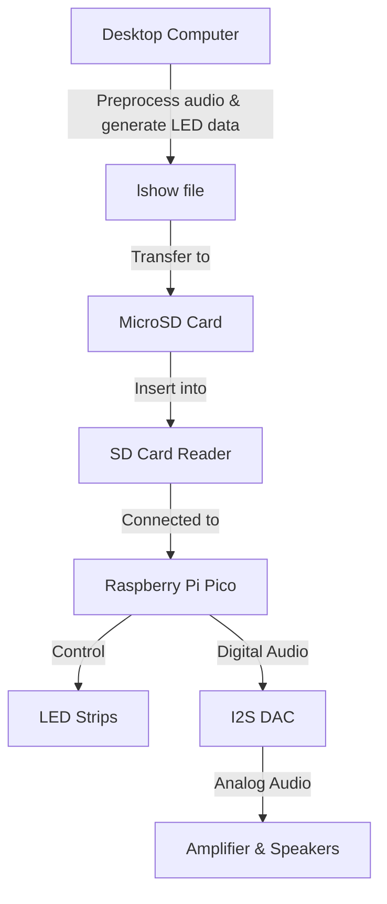

# LSPicoPi
This is a revision of LightShowPi (https://bitbucket.org/togiles/lightshowpi/), software designed for the Raspberry Pi Pico microcontroller. Hopefully, it will require fewer dependencies than LightSHowPi and the Raspberry Pi.
For initial sampling I used the song Sleigh Ride by Leonard Bernstein and the Boston Pops. 

Given this prompt, Claude provided the following framework:
"If i wanted to create a box that would take songs in mp3 format, use ffmpeg to create and save a file reflecting a spectrum of 8 frequencies. When turned on, the circuit would trigger relays corresponding to 8 strands/channels of conventional leds. It would randomize playback of the songs."

"That's an interesting project idea! You're essentially describing a custom audio visualizer that analyzes music and controls LED strips based on frequency content. Here's a high-level overview of how you could approach this:

Audio Input and Processing:

Use a microcontroller or single-board computer (like Raspberry Pi) to read MP3 files.
Utilize FFmpeg to convert MP3 to raw audio data.
Implement a Fast Fourier Transform (FFT) to analyze the frequency content.

Frequency Analysis:

Divide the audio spectrum into 8 frequency bands.
Calculate the energy/amplitude in each band.

LED Control:

Map each frequency band to a relay controlling an LED strip.
Adjust LED brightness or patterns based on the energy in each band.

Playback System:

Implement a simple file system to store and access MP3 files.
Create a randomization function for song selection.

Hardware:

Use a microcontroller with sufficient processing power and storage.
Include 8 relays to control the LED strips.
Add an amplifier and speaker for audio output.

Here's a basic pseudocode outline for the main loop:
"while True:
    randomSong = selectRandomSong()
    rawAudio = convertMp3ToRawAudio(randomSong)
    
    while audioStillPlaying:
        frequencyData = performFFT(currentAudioChunk)
        energyLevels = calculateEnergyLevels(frequencyData)
        
        for i in range(8):
            if energyLevels[i] > threshold:
                activateRelay(i)
            else:
                deactivateRelay(i)
        
        playAudioChunk()
        
    waitForNextSong()"

Given these requirements, Claude proposed the following:
import json
from pydub import AudioSegment
import numpy as np

def analyze_song(mp3_file, num_channels=8, chunk_ms=50):
    # Load the MP3 file
    audio = AudioSegment.from_mp3(mp3_file)
    
    # Convert to mono for simplicity
    audio = audio.set_channels(1)
    
    # Prepare the output data structure
    output_data = []
    
    # Process the audio in chunks
    for i in range(0, len(audio), chunk_ms):
        chunk = audio[i:i+chunk_ms]
        
        # Convert to numpy array
        samples = np.array(chunk.get_array_of_samples())
        
        # Perform FFT
        fft_result = np.fft.fft(samples)
        magnitude_spectrum = np.abs(fft_result)
        
        # Divide into frequency bands
        band_energies = np.array_split(magnitude_spectrum[:len(magnitude_spectrum)//2], num_channels)
        
        # Calculate energy in each band
        energy_levels = [int(np.sum(band)) for band in band_energies]
        
        # Normalize energy levels to 0-255 range for LED brightness
        max_energy = max(energy_levels)
        if max_energy > 0:
            energy_levels = [int((e / max_energy) * 255) for e in energy_levels]
        
        output_data.append(energy_levels)
    
    return output_data

def save_analysis(output_data, filename):
    with open(filename, 'w') as f:
        json.dump(output_data, f)

# Example usage
mp3_file = "path_to_your_song.mp3"
output_data = analyze_song(mp3_file)
save_analysis(output_data, "song_analysis.json")

# Arduino/RP2040 pseudocode for playback
"""
#include <ArduinoJson.h>

void setup() {
  // Initialize LED pins, file system, etc.
}

void loop() {
  // Read JSON file
  File file = SD.open("song_analysis.json");
  DynamicJsonDocument doc(MAX_FILE_SIZE);
  deserializeJson(doc, file);
  
  // Play audio file separately
  
  // Iterate through the analysis data
  for (JsonArray frame : doc.as<JsonArray>()) {
    for (int i = 0; i < 8; i++) {
      analogWrite(LED_PINS[i], frame[i].as<int>());
    }
    delay(50);  // Assuming 50ms chunks
  }
}
"""

Claude created and I tested the following on my Ubuntu system: 
1. From your terminal install FFMPEG
**sudo apt-get install ffmpeg**
2. Set up a location for your virtual environment where you will do song analysis, test, and create your JSON or other related files, then open that folder.
**cd /home/study/projects/mp3_analysis
python3 -m venv venv
source venv/bin/activate**
3. Install numpy
**pip install numpy matplotlib scipy pydub**
4. Create the following files:

#### 2024-10-06 updates 
I got the Pico working (after having to be schooled in Circuit Python and Thonny). 

I could upload the provided main.py and minimal_test.lshow onto my Pico (and it's breakout board) and get it to run. **However**, the lshow file (combining music and FFMPG json data) was way too big to be able to load onto the Pico. So, it looks like I'll need to connect a MicroSD card. 

Below is my conversation with Claude.ai without whom I could not do this.   

You've raised some excellent points that get to the heart of system design for your LightShowPi replacement. Let's break this down:

1. MicroSD processing capability:
MicroSD cards are certainly capable of streaming the data at the rates you'd need for this application. Even basic Class 4 SD cards can manage 4MB/s read speeds, which is more than enough for your LED control data and audio playback.

2. Raspberry Pi Pico capabilities:
The Pico, while powerful for its size and cost, is indeed less capable than a full Raspberry Pi. Here's a breakdown of what it can likely handle:

   a) LED control: This is well within the Pico's capabilities. Managing 8 LED channels at typical update rates (e.g., 50-100 Hz) is not computationally intensive.

   b) Audio playback: This is where things get tricky. The Pico doesn't have built-in audio output capabilities like the Raspberry Pi. It can generate audio signals, but you'd need additional hardware (like a DAC) to produce high-quality audio. 

3. Desktop preprocessing approach:
Your idea of doing the heavy lifting on a desktop and having the Pico handle playback is a smart one. It aligns well with the Pico's strengths and mitigates its limitations. Here's how this could work:

Here's a breakdown of this architecture:

1. Desktop Preprocessing:
   - Analyze the audio file and generate LED control data.
   - Package this data along with the audio into your lshow format.
   - This offloads the computationally intensive work from the Pico.

2. Data Transfer:
   - Store the lshow file on a MicroSD card.
   - The Pico reads from this card during playback.

3. Pico Playback:
   - The Pico reads the lshow file from the SD card.
   - It sends control signals to the LEDs based on the preprocessed data.
   - For audio, it streams the digital audio data to an external DAC.

4. Audio Output:
   - Use an I2S DAC (Digital-to-Analog Converter) connected to the Pico.
   - The Pico streams digital audio data to the DAC, which converts it to analog.
   - The analog signal goes to an amplifier and then to speakers.

This setup is indeed possible and plays to the strengths of both your desktop system and the Pico. The desktop handles the complex processing, while the Pico manages real-time playback of the preprocessed data.

To implement this, you'd need to:
1. Modify your desktop software to output the lshow files in a format optimized for the Pico's playback.
2. Develop Pico firmware that can read the lshow files and control both LEDs and audio output.
3. Set up the hardware: Pico, SD card reader, I2S DAC, LED controllers, and audio amplifier.

This approach gives you the best of both worlds: the processing power of a desktop for the complex tasks, and the real-time capabilities and simplicity of the Pico for playback. It also makes your system more maintainable, as most updates would happen on the desktop software, with the Pico firmware remaining relatively stable.

Would you like me to elaborate on any part of this system design or provide some example code for the Pico side of things?
